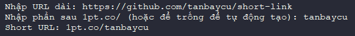
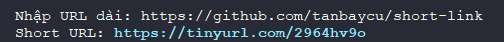

# Short Link - @T7C

Công cụ rút gọn link url dài mã hóa bằng `1pt` (1Point) và `tinyurl` (Tinyurl).


## Mục lục
1. [Cài đặt các thư viện phụ thuộc](#cài-đặt-phụ-thuộc)
2. [Rút gọn với 1pt](#rút-gọn-với-1pt)
3. [Rút gọn với Tinyurl](#rút-gọn-với-tinyurl)

---

## Cài đặt phụ thuộc
```bash
pip install requests
```

## Rút gọn với 1pt
1. Tác giả: [Link web và tác giả](https://1pt.co/)

2. Sử dụng mã dưới đây:
```python
import requests
import re


def validate_url(url):
    regex = re.compile(
        r'^(http://www\.|https://www\.|http://|https://)?[a-z0-9]+([\-\.]{1}[a-z0-9]+)*\.[a-z]{2,}(:[0-9]{1,5})?(\/.*)?$'
    )
    return re.match(regex, url) is not None


def send_request(long_url, short_url=""):
    if validate_url(long_url):
        try:
   
            encoded_long_url = requests.utils.quote(long_url)
            encoded_short_url = requests.utils.quote(short_url)
            
            request_url = f"https://csclub.uwaterloo.ca/~phthakka/1pt/addURL.php?url={encoded_long_url}&cu={encoded_short_url}"


            response = requests.get(request_url)
            response.raise_for_status()


            if response.status_code == 201:
                data = response.json()
                returned_short_url = f"1pt.co/{data['short']}"
                return returned_short_url, (short_url != "" and data['short'] != short_url)
            else:
                return None, False
        except requests.exceptions.RequestException as e:
            print(f"Error: {e}")
            return None, False
    else:
        print("Invalid URL!")
        return None, False


def remove_prefix(base_string, to_remove):
    for item in to_remove:
        base_string = re.sub(item, "", base_string, flags=re.IGNORECASE)
    return base_string


long_url = input("Nhập URL dài: ").strip()
custom_url = input("Nhập phần sau 1pt.co/ (hoặc để trống để tự động tạo): ").strip()

short_url, show_warning = send_request(long_url, remove_prefix(custom_url, ["1pt.co/", "/", "\\?"]))

if short_url:
    print(f"Short URL: {short_url}")
    if show_warning:
        print("Your requested URL was not available, a random URL was generated.")
else:
    print("Không thể rút gọn URL.")

```
---


## Rút gọn với Tinyurl
1. [Cài đặt phụ thuộc](#cài-đặt-phụ-thuộc)

2. Sử dụng mã bên dưới:
```python
import requests

TINYURL_API = "http://tinyurl.com/api-create.php?url="

def shorten_url_tinyurl(long_url):
    try:
        response = requests.get(TINYURL_API + long_url)
        response.raise_for_status()
        return response.text
    except requests.exceptions.RequestException as e:
        print(f"Error while shortening URL: {e}")
        return None

def main_tinyurl():
    long_url = input("Nhập URL dài: ").strip()
    short_url = shorten_url_tinyurl(long_url)

    if short_url:
        print(f"Short URL: {short_url}")
    else:
        print("Không thể rút gọn URL.")

if __name__ == "__main__":
    main_tinyurl()

```
---


## Liên hệ
| Type    | Detail                     |
|---------|----------------------------|
| Name    | Tan 7 Cu                   |
| Email   | [tranminhtan4953@gmail.com](mailto:[tranminhtan4953@gmail.com) |
| Telegram| [TRAN MINH TAN](t.me/tanbaycu)                 |
| Facebook| [Tran Minh Tan](https://facebook.com/tanbaycu) |


## Tài liệu tham khảo
- 1pt.co (https://1pt.co/)
- TinyURL (https://tinyurl.com)

